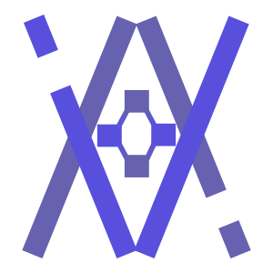

    
    <h1>VoteVault</h1>
    
An advanced voting platform integrating Stellar smart contracts with NestJS and Angular, ensuring secure, transparent, and verifiable voting processes.

---

# Table of Contents

- [Features](#features)
- [Usage](#usage)
- [Contributing](#contributing)
  - [Developer Guidelines and Repository Setup](#developer-guidelines-and-repository-setup)
  - [Development Previews](#development-previews)
- [License](#license)
- [Credits](#credits)
  - [Special Thanks](#special-thanks)
  - [Contributors](#contributors)

# Features

VoteVault is designed to revolutionize voting processes with its cutting-edge features:

- **Stellar Smart Contracts**: Ensure secure and verifiable voting through Stellar smart contracts.
- **NestJS Backend**: Benefit from a robust and scalable backend powered by NestJS.
- **Angular Frontend**: Enjoy a sleek, responsive user interface designed using Angular, optimized for both desktop and mobile devices.
- **MongoDB Integration**: Utilize MongoDB for efficient storage and management of votes and "user" data.
- **Completly Anonymous**: VoteVault ensures that all votes are anonymous and cannot be traced back to the voter.
- **Secure and Transparent**: VoteVault guarantees secure and transparent voting processes, ensuring the integrity of the voting system.
- **Verifiable Results**: All votes are stored on the Stellar blockchain, allowing for easy verification of the voting results.

# Contributing

Contributions are appreciated and needed to make VoteVault the best voting platform out there. If you want to contribute, please read the [Contributing Guidelines](.github/CONTRIBUTING.md), [Code of Conduct](.github/CODE_OF_CONDUCT.md), and [Developer Certificate of Origin](.github/DCO.md) first.

## Developer Guidelines and Repository Setup

We have several documents for developers to help them get started with the project. You can find them in the `docs` or `.github` directory. Here are some of the most important ones:

- [Contributing Guidelines](.github/CONTRIBUTING.md)
- [Workflow](docs/WORKFLOW.md)
- [Best Practices](docs/BEST_PRACTICES.md)
- [Formatting](docs/FORMATTING.md)
- [Dev Actions](docs/DEV_ACTIONS.md)

## Development Previews

We deploy the latest development version of VoteVault to a staging environment. You can find the latest preview at:

- [VoteVault Development Preview](https://dev-preview-votevault.web.app/)

# License

This project is licensed under the [MIT License](LICENSE). By contributing to VoteVault, you agree that your contributions will be released under the same license. Also, you agree to the [Contributor Covenant Code of Conduct](.github/CODE_OF_CONDUCT.md) and [Developer Certificate of Origin](.github/DCO.md).

# Credits

## Special Thanks

Thanks to the following projects and their contributors for making VoteVault possible:

- [Stellar](https://stellar.org)
- [NestJS](https://nestjs.com/)
- [Angular](https://angular.io/)

This project was done as part of the [Stellar Smart Contract Challenge](https://dev.to/challenges/stellar) on [Dev.to](https://dev.to/).

## Contributors

Thanks to the following people for their contributions:

Released under [MIT License](LICENSE) by [@danieljancar](https://github.com/danieljancar).
